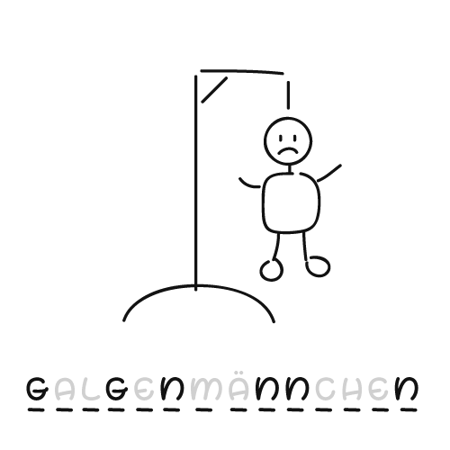

Dieses Projekt dient dazu, deine ersten Unit-Tests mit JUnit 5 zu schreiben. Im Package `maexchen` findest du eine Anwendung
aus dem ersten Lehrjahr. Die Klasse `Maexchen` modelliert die Regeln nach denen die Punktzahl in diesem Trinkspiel ermittelt wird.
Zur Erinnerung: 

1.	Der Wurf 1, 2 heißt „Mäxchen“ und ist 1000 Punkte wert.
2.	Ein Wurf mit zwei gleichen Augenzahlen wird als „Pasch“ bezeichnet und ist 100 * Augenzahl wert. Der Wurf 4, 4 hat also den Wert 400.
3.	Ansonsten ergibt sich die Punktzahl als 10 * höhere Augenzahl + niedrigere Augenzahl. Der Wurf 3, 5 hat beispielsweise die Punktzahl 53.

Die Klasse `MaexchenTest` testet die Funktionalität voll umfänglich. Sie liefert Codebeispiele für ganz normale Unittests, 
parametriserte Tests und das Testen von Exceptions. Orientiere dich bei der Formulierung deiner Tests an dieser Klasse. 

## Aufgaben 

0. Studiere den Quellcode für die Unittests in der Klasse `MaexchenTest`. Beachte, dass die Testklasse im selben Package wie der produktive Code liegt. Das ist zwingend erforderlich. Kläre für dich die Fragen 
a) welche Bedeutung hat die Annotation `@DisplayName`?
b) was ist mit Arrange, Act und Assert gemeint? 
c) was ist ein parametrisierter Test?

Tests können in JUnit 5 mit verschiedenen Assertions formuliert werden. Lies dazu https://www.javaguides.net/2018/07/junit-5-assertions-with-examples.html.
1. Implementiere im Package `hangman` die Klasse `HangmanTest`.
2. Schreibe einen Test, der ein neues Spiel initiert und die Methode `giveNewTry()` testet. Sie gibt für jeden Buchstaben des zu ratenden Wortes einen Unterstrich zurück. Wenn du zur besseren Lesbarkeit deiner Tests die Annotation `@DisplayName` sinnvoll findest, verwende sie. Führe den Test aus.
3. Refactore den Test zu einem parametrisertem Test, der die Methode `giveNewTry()` mit mindestens drei Worten unterschiedlicher Länge testet. Lies für die Formulierung von parametrisierten Tests auch https://www.baeldung.com/parameterized-tests-junit-5. 
4. Schreibe einen Test, der einen ersten (erfolgreichen) Rateversuch simuliert, also die Methode `guessCharacter()` aufruft, und das zu ratende Wort mit Unterstrichen und aufgedeckten Buchstaben auf Richtigkeit prüft. Beispiel: Für das Wort Developer und dem Rateversuch mit dem Buchstaben e muss die Methode _e_e___e_ zurückgeben.
5. Formuliere einen Test, der den ersten und zweiten Rateversuch testet, also überprüft, ob beide Buchstaben richtig aufgedeckt werden. 
6. Formuliere einen Test, der einen Fehlversuch simuliert.
7. Formuliere einen Test, der den ersten Buchstaben des Wortes aufdeckt und überprüft, ob bei einem Substantiv der erste Buchstabe groß geschrieben zurückgegeben wird.
8. Gute Unit- oder Komponenten-Tests zeichnen sich durch mehrere Kriterien aus. Erweitere dein Wissen zu Unit-Tests, indem du den verlinkten Artikel auf https://www.informatik-aktuell.de/entwicklung/methoden/gute-unit-tests-und-testgetriebene-entwicklung-tdd.html bis zum abschließenden Abschnitt zum TDD liest. Erstelle dir einen Merkzettel, der dich die Bedeutung der FIRST-Prinzipien behalten lässt.